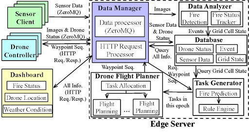

# DOME: IoT-Based Monitoring of Emergent Events For Wildland Fire Resilience

<br/>

### Description

An IoT system for fire monitoring and disaster response. Uses drones, IoT devices, and data analysis to enhance wildfire management. Provides timely information, predicts fire behavior, and optimizes resource allocation for accurate and efficient response. Empowers emergency respondents to make informed decisions and minimize wildfire impact.

<!-- UCI 2023 Spring CS 295P Keystone project - DOME

<<<<<<< HEAD
An IoT system for fire monitoring and disaster response. Uses drones, IoT devices, and data analysis to enhance wildfire management. Provides timely information, predicts fire behavior, and optimizes resource allocation for accurate and efficient response. Empowers emergency respondents to make informed decisions and minimize wildfire impact.

<br/>
=======
[Learn more about the project](https://trello.com/b/OMCMnthy/project) -->

### Structure



<br/>

### [Poster](Resources/Poster.pdf)

<br/>

### Usage

##### Dashboard

`cd Dashboard`

`npm i`

`npm start`

##### Server

`cd Edge Server`

`python db_handler.py`

`python zmq_subscriber.py`

##### Task Generation

Must be in Linux Env

`cd Task_generation`

`python FQ_Firesim_Testbed.py`

##### Sensor

##### Drone

### Video

<iframe width="560" height="315" src="https://www.youtube.com/embed/NQfSgAU3RjU" title="YouTube video player" frameborder="0" allow="accelerometer; autoplay; clipboard-write; encrypted-media; gyroscope; picture-in-picture; web-share" allowfullscreen></iframe>

### Common problems

**Set Raspberry pi startup script**

Edit `/etc/rc.local`

Add a new line to call the script

**Note** The file runs as root, you need to install the packages as root using sudo.

`sudo python /home/pi/sample.py &`

Must contain a *&* if the script won't end automatically.

**Add networks and switch between them**

Edit `/etc/wpa_supplicant/wpa_supplicant.conf` and set different priority to each netwsudo

Example:

```
network={
    ssid="SCHOOLS NETWORK NAME"
    psk="SCHOOLS PASSWORD"
    priority=1
}
```

Larger priority is accessed 1st.

Use `wpa_cli -i wlan0 select_network 0` to switch to the 1st.

PS: after call the command, until reboot or manually cancelled using `wpa_cli -i wlan0 enable_network all`, other networks will be disabled.

If can't access using hostname, access the router to find the ipaddress of raspberry pi, then ssh to it using ip address instead of hostname.

**Find mongodb ip** 

Use db.runCommand({whatsmyuri: 1}) after selecting a database in mongosh
